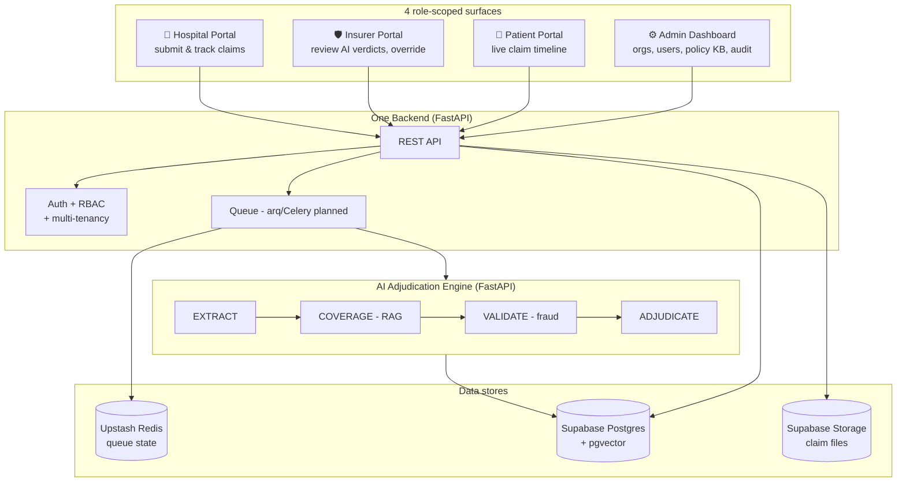
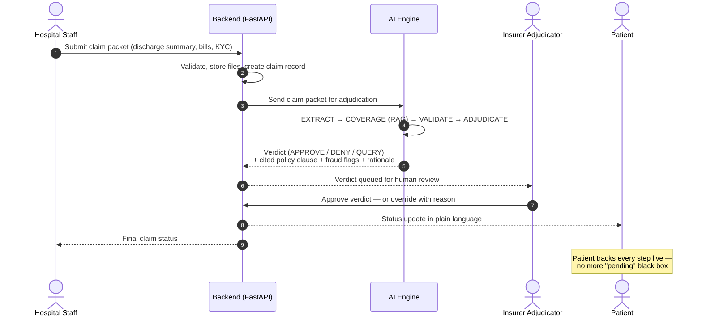
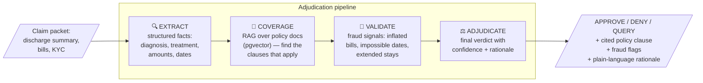
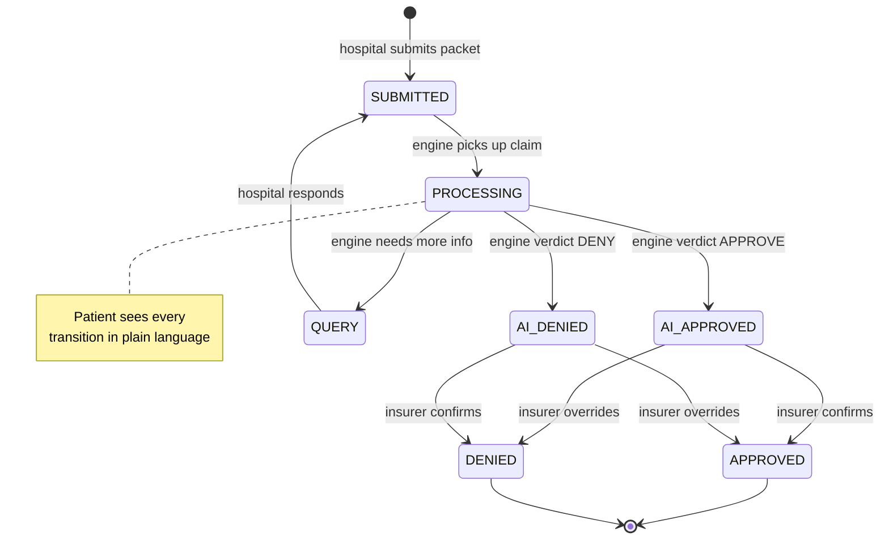
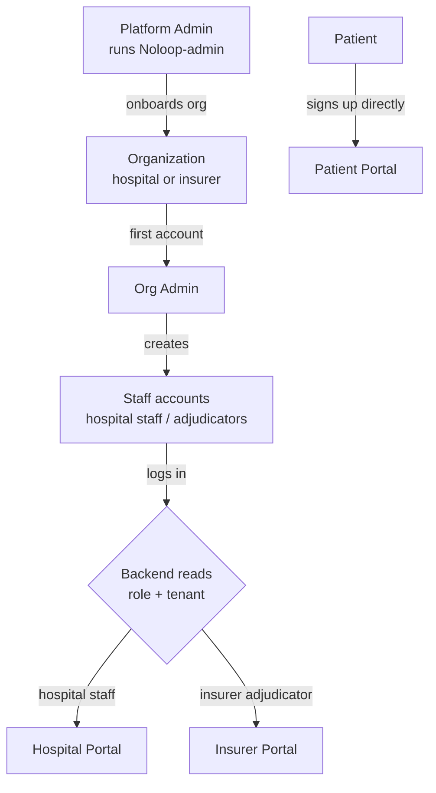

# NoLoop

**An AI that doesn't assist claim adjudicators — it *is* one.**

NoLoop is a multi-tenant platform that autonomously adjudicates health-insurance claims. A hospital submits a claim, the AI engine decides it in seconds — with the exact policy clause cited, fraud flags raised, and a plain-language rationale — an insurer reviews or overrides, and the patient tracks it live.

> 🎥 [Watch the demo](https://youtu.be/946GA4_ADkc?si=Zpp9CV9ecDXSeQLU)

## Why

Indian health-claim processing is manual and fragmented:

- Doctors hand-process **50–80 claims/day**; cashless takes **2–3 hrs/claim**, reimbursement **7–15 days**
- Fraud runs **~15%/yr**, costing insurers **₹8,000–10,000 cr/yr**
- Patients have **zero transparency** — no way to track a claim or learn why it was denied

## High-level architecture

One FastAPI API serves all roles — responses are scoped by the caller's **role + tenant**. The frontend never touches the database directly.

## The golden path — end-to-end claim workflow

## Inside the AI engine

The core is a **typed pipeline, not a chatbot**. Every claim is processed for real — nothing is hardcoded.

**Humans override — they don't operate.** Every verdict is auditable: the insurer sees exactly which policy clause drove the decision and can overrule it with a reason, which is logged.

## Claim lifecycle

## Onboarding & identity

**Tenant** = an organization (hospital or insurer). **User** = a person who logs in, scoped to a tenant.

Login is email + password with custom JWT. Org context comes from the user's `tenantId` — no separate company password.

## Data approach

Real insurer policy documents can't be used (IP/legal). All input data is **synthetic** — generated discharge summaries, bills, KYC, and fictional policy docs. The engine's *processing* is 100% real; only the *inputs* are synthetic.

## Repos & tech stack

| Piece | Tech | Where |
|---|---|---|
| Frontend (hospital / insurer / patient) | Next.js 15, React 19, Tailwind 4, Bun | `/` (this repo root) |
| Backend API | FastAPI + SQLAlchemy 2.0 (async) | `/backend` |
| AI Engine | FastAPI + Claude + pgvector RAG | `/ai` |
| Admin dashboard | Next.js (separate repo) | `Noloop-admin` |
| Data | Supabase Postgres + pgvector, Supabase Storage, Upstash Redis | — |

See [docs/](./docs/) for architecture, API, DB schema, and roadmap details.

## License

MIT — see [LICENSE](./LICENSE). The NoLoop name, brand, and demo assets are not covered by the code license.
